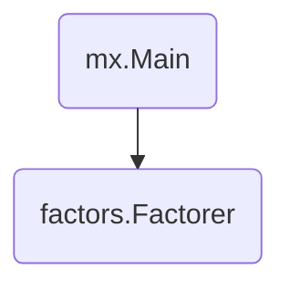

# Factors

This directory contains a MX application that computes the factors
of a number. This application is interesting because it demonstrates routing.

This app has a `Factorer` component with a `Factor(context.Context, int) ([]int,
error)` method. The `Factorer` component maintains a fixed-size LRU cache that
maps integers to their factors. The `Factor` method is routed based on the
provided integer. Repeated calls to the `Factor` method with the same integer
will tend to route to the same component replica. This improves the cache hit
rate of the `Factorer` component.



## Running Locally

To run this app locally, run `go run .`:

```console
go run .
```

In a separate terminal, curl the service (which defaults to `localhost:9000`):

```
$ curl localhost:9000?x=100
[1 2 4 5 10 20 25 50 100]
```

To run the app across multiple processes, use `mx multi deploy`:

```console
mx multi deploy mx.toml
```

When a `Factorer` component receives an invocation of its `Factor` method, it
logs its process id. If you repeatedly curl the service, you can inspect the
pids to confirm that requests are being routed.

## Running on GKE

To run the app on GKE, use `mx gke deploy`:

```console
$ mx gke deploy mx.toml
```
