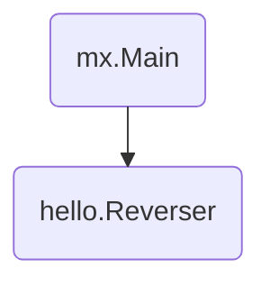

# Hello

This directory contains the "Hello, World!" application from the ["Step by Step
Tutorial"][tutorial] section of the [MX documentation][docs]. To run
the application, run `go run .`.  Then, curl the `/hello` endpoint (e.g., `curl
localhost:12345/hello?name=Alice`).

[docs]: https://mx.dev/docs.html
[tutorial]: https://mx.dev/docs.html#step-by-step-tutorial
