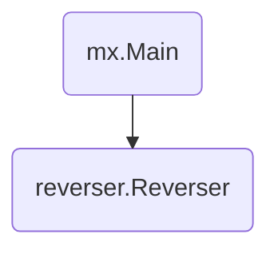

# Reverser

This directory contains a MX web application that reverses text.
The application has a main component and a `Reverser` component.



## How to run?

To run this application locally in a single process, run `go run .` To run the
application locally across multiple processes, use `mx multi deploy`.

```console
$ go run .                        # Run in a single process.
$ mx multi deploy mx.toml # Run in multiple processes.
```

## How to interact with the application?

If running locally, open `localhost:9000` in a browser. You can also curl the
`/reverse` endpoint directly.

```console
$ curl localhost:9000/reverse?s=foo
oof
```

TODO(mwhittaker): Run on GKE.
